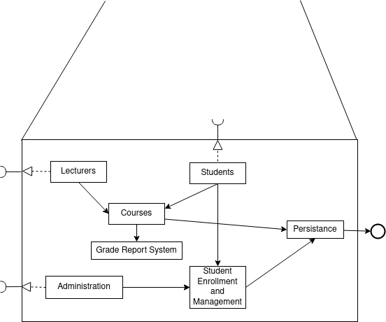
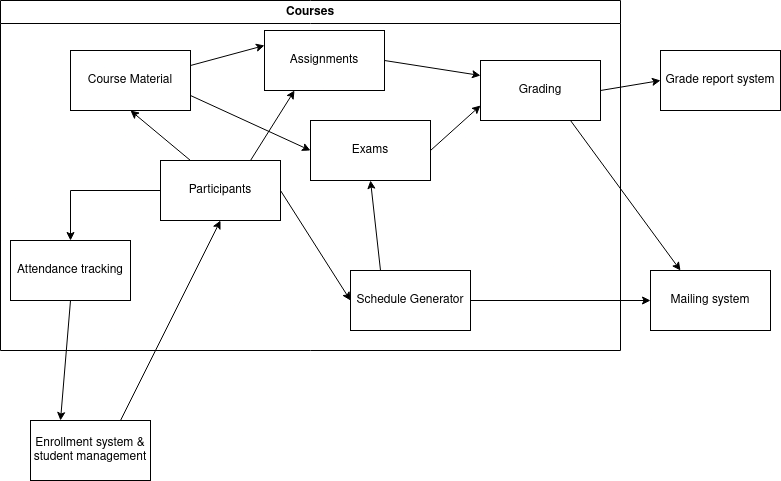
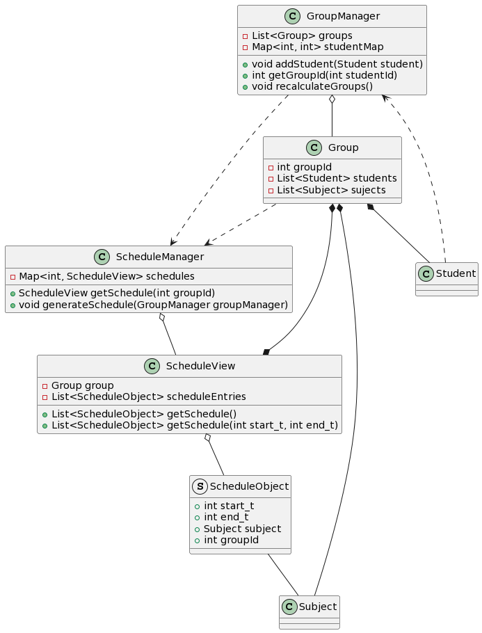
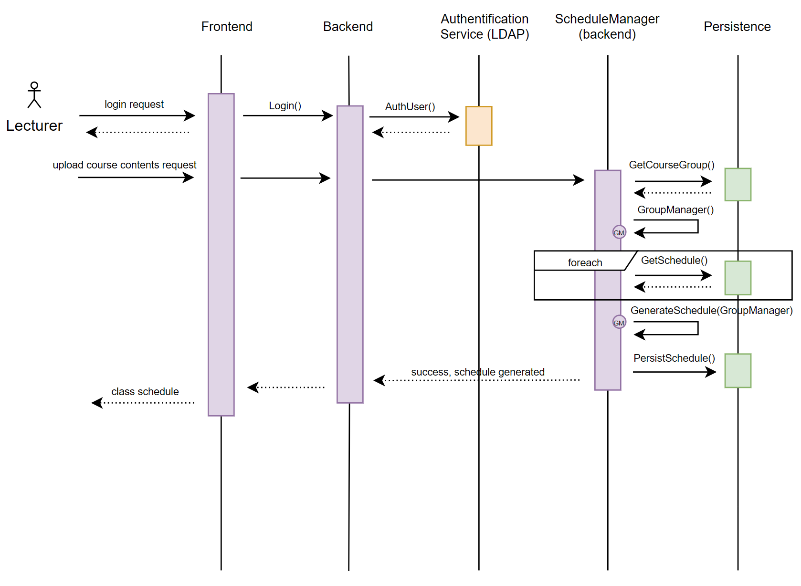
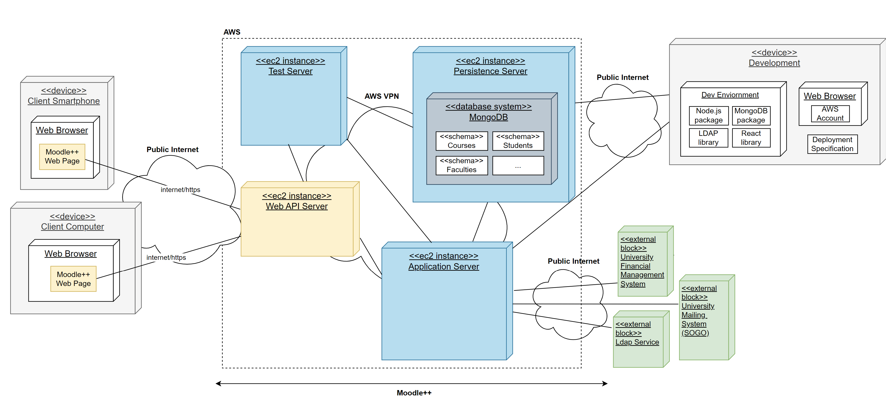
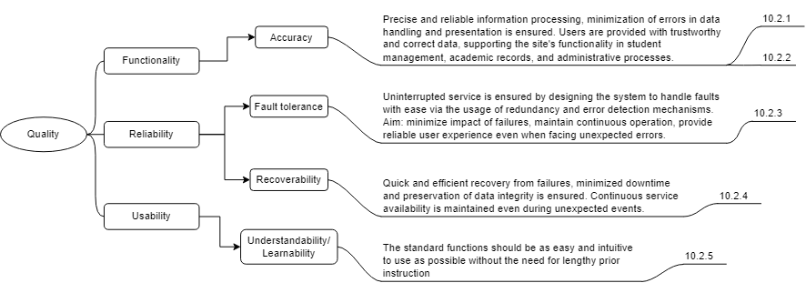

# 

# Introduction and Goals

One of our business partners, the university of applied science FH Technikum Wien tasked us to build them a new university management platform. The goal is to create a uniform platform that simplifies all processes for student and class management, grading, and scheduling, and makes them available in one place. As such our stakeholders consist of different factions from the FH Technikum Wien, from here on out refered to as FHTW, which we will elaborate on later on in the document.

As the FHTW is a public institution, we need to set a focus on stability and testing, as we want to avoid inconsitent behaviour or servere technical issues that would impact day-to-day operations.

## Requirements Overview

Our client currently uses a mix of different systems to manage their day-to-day operations, and prefer a single platfrom incorporating all current functionality in one place. Furthermore some workflows are convoluted due to needing multiple different systems, and should be simplified in our system.

Our software has thus to implement the following main functions:

| Feature                 | Description                                                                                    | Actor          |
|-------------------------|------------------------------------------------------------------------------------------------|----------------|
| Student enrollment      | Choosing and managing courses                                                                  | Students       |
| Attendance tracking     | Automation of existing paper process                                                           | Lecturers      |
| Course resources        | Consistent access to material (slides, examples, exercises, and assignments), and online exams | Students       |
| Course grade management | Tracking of assignment and exam scores                                                         | Lecturers      |
| Report generation       | Calculates and sends out final reports based on the grades from the grade management system    | Administration |

Please see the full [business requirements document](https://github.com/marvkos/swarc-material/blob/main/materials/university%20managment/brd.md) for more details.

## Quality Goals

| Quality Goal | Quality Scenario |
|--------------|------------------|
| Learnability & Understandability | A new student can find the see the schedule, course contents, deadlines, and other resources without additional information and within the first minutes of using the application. |
| Accuracy | The correct grades, added by lecturers or by the system (in the case of automatic grading), are shown to the student. |
| Recoverability | A server crashes and a user session is recovered within the first 10 minutes by using persistence mechanisms. |
| Fault tolerance | A user has bad internet connection. Upload process does not have to be started anew. |

## Stakeholders

| Name/Role                              | Expectations                                                                                                    |
|----------------------------------------|-----------------------------------------------------------------------------------------------------------------|
| John Smith, Administrator              | An efficient and user-friendly platform for managing academic and administrative activities                     |
| Jane Doe, Senior Lecturer              | Easier and more efficient management of class information; more error correction through purpose-built software |
| Michael Lee, Chief Information Officer | Ability to take data-driven decision making through reporting and analytics                                     |
| Emily Chen, Student Representative     | Enhanced communication and collaboration possibilities among students, faculty, and staff                       |
| Sarah Johnson, Financial Officer       | A streamlined billing and payment processes                                                                     |

# Architecture Constraints

The following table contains the key constraints that should be adhered to, ordered by their relevance.  

| Constraints | Background and/or Motivation |
| ------------------------- | ------------------------- |
| Run on every system | To make the application accessible to everyone, users must not require special/specific devices to use it.          |
| Integration with other university tools | The system should be compatible with existing tools and software of the university, such as the mailing (SOGO) and campus inforamtion system (CIS).  |
| Accessible from outside     | Users should not be required to be on premise to use the application. |
| Adaptable for different universities     | Design and features should be customizable and adjustable to the needs of individual universities. |

[//]: # (Simple tables of constraints with explanations. If needed you can
subdivide them into technical constraints, organizational and political
constraints and conventions e.g. programming or versioning guidelines,
documentation or naming conventions)

# System Scope and Context

**Context View**

| Neighbor | Description |
|---|---|
| Student | Enrolls in a course through the system. Follows the schedule generated by the system. Finds course contents, information and other course resources. Uploads assignments and takes online tests. |
| Faculty Member | Uploads course contents, information and other course resources, with which the system automatically generates the schedule. Tracks attandence for a class. Grades student assignments and tests, and gives feedback either individually or to groups. |
| Administrator | Manage student data, student enrollment. Can rework course schedule on demand. |
| University Mailing System (SOGO) | Automatic notification of schedule updates, grading. Central information system for students. |
| LDAP | Stores system data. Single Sign-on |

# Solution Strategy

- Usability for untrained users will be achieved by reducing the landing page to the most important functions, and putting more advanced functionality on corresponding subpages.
- The platform will be hosted on AWS to allow for easy automatic backups, and ensure availability.
- Due to using AWS we will be able to use Amazon provided analytics services to aid with data-driven decision making.
- We will keep using the univerities existing LDAP-service to ensure only authorized users can access certain functionality.

# Building Block View

1. Level 1

| Block | Description |
|---|---|
| Courses | Main component handling courses |
| Grade Report System | Separate application for final reports, partially adapted from legacy system |
| Persistance | Database and file handling service, uses MongoDB |
| Student Enrollment and Managment | Handles information and status of students, partially adapted from legacy system |
| Frontend web-service | NGinX web-server |

2. Level 2

| Block | Description |
|-----|-----|
| Course Material | Processes course data and interfaces with the web-service to display to the user |
| Participants | Links enrolled students to courses |
| Assignments | Handles uploads and schedules for hand-ins |
| Exams | Handles times for exams and some automatic grading |
| Grading | Calculates grades from assignments and exams and forwards them to the mail system/grade report system |
| Attendance tracking | Collects attendance during classes to forward to enrollment system |
| Schedule Generator | Generates conflict free schedules |

All services interface via REST, the full specifications will be found in the OpenAPI .yaml file.

## Course Material (Blackbox)
The course material component constructs a course in form of the defined course xml format (\*not actual), or constructs questions based on the material. It takes data from the persistence service. The following methods are available through its REST-interface, as defined in the OpenAPI .yaml file:
- `GET /course/{courseID}`: returns an xml formated course. A lecturers view will be returned automatically if authorized as such via token.
- `POST /course/{courseID}/exam`: returns exam questions (xml), `class_start` and `class_end` as paramters specify for which classes to take questions from
- `GET /course/{courseID}/assignemnts/{class}`: returns assignment text and deadline in unix epoch (xml) for each assignemnt in the class or an empty list, class specifies which class to take from (optional).

3. Level 3

# Runtime View

## Student Enrollment

This scenario showcases the standard procedure that happens during most of the use cases, and how the application Moodle++ interacts with external blocks. 

Upon launch, the user is always authentificated through LDAP.

Notifications are sent through email in addition to the users Moodle++ account.

Information is stored/persisted in the MongoDB Databank.

## Schedule Generation

A unique feature of Moodle++ is it’s automatic schedule generation based on class information (and data from other courses).

Prerequisites:
-	Students have to be enrolled in a course based on the description.
-	After the enrollement period and before the start of the semester, the course contents should be uploaded by a lecturer/faculty member.
- Enough students should be enrolled to form a „Group”.

## Generate Reports

**Steps:**
1. The administrator logs in and navigates to the "Reports" section on the Moodle++ web page, where he selects the type of report to be generated.
2. The request is sent to the application with parameters such as the date range or specific courses, selected by the administrator.
3. An instance of the ReportGenerator is created within the system.
4. The report is generated.
    4.1. If a student progress report is to be generated, the ReportGenerator retrieves the necessary evaluation criteria previously set by the lecturer in addition to the given parameters. The score of the student is calculated, and the report is generated. 
    4.2. If an enrollment report is necessary, the system retrieves the data and generates the report.
    In both cases, the report is displayed to the administrator.
5. If desired, the administrator can download the report.

# Deployment View

## Overview Diagramm

|Node| Description|
|----|----|
|Client Computer| Users can access the Moodle++ web page from their computers or laptops|
|Client Smartphone| Alternatively, users can access the Moodle++ web page throught their mobile devices|
|Web API| Includes the API Gateway and the necessary firewall rules for safety |
|Application| Comprises the User Interface (frontend with React) Business Logic (backend with Node.js)|
|Persistence| Contains MongoDB Database with the following schemas: Courses, Students, Faculties, Grades, Class Sessions (Attendance Management), Transactions (Payments) |
|Test | The EC2 test instance runs test all other Moodle++ nodes (persistence, web API and application)|

Prerequisites:
Moodle++ developers need an environment for working with React, Node.js, MongoDB and the external Authentication Service (LDAP library).
Developers require an AWS account for deployment along with the deployment specification.

# Cross-cutting Concepts

## Development concepts

The code should follow the Java style guidelines as defined [by Google](https://google.github.io/styleguide/javaguide.html), but should be adapted as needed.

The system shall have 90% test coverage, with security critical components having at least 95% test coverage.

Class properties are always private, and only have getters or setters if needed.

## Safety and security concepts

Any request needs to use the LDAP service for authentication. The LDAP service shall implement Role Based access control. LDAP was already used by the client beforehand, and to avoid security issues when switching to a new system, the existing system will be used.

## Architecture and design patterns

A service oriented architecture shall be used, services shall interface using REST. As AWS will be used, each service is a separate instance.

## Operation Concepts

All systems running in the AWS-cloud need to make daily backup, saving the last 3 days, then weekly back-ups for the last 4 weeks, then monthly backups. All backups will also be stored on an external system. Security critical system shall also make hourly backups, saving them for 24h. 

## User Experience concepts (UX)

Functionality per page shall always be limited to one topic to keep the UI simple, especially for new users. Each function shall also be clear in its use.

# Architecture Decisions

## ADR 01: Central data storage
### Status
Accepted

### Context
Inconsistent data across multiple servers impacts data reliability and integrity.

### Decision
We will adopt a singular database as the central data storage solution for our software to ensure a unified and reliable source of data.

### Consequences
The adoption of a singular database promotes data consistency. 
On the other hand, it will require careful monitoring of system performance and scalability considerations. As the system evolves, periodic assessments may be necessary to ensure the continued effectiveness of the chosen solution.

## ADR 02: LDAP Authentification
### Status
Accepted

### Context
The university this project is for already uses LDAP for authentication.

### Decision
We will build upon that and also work with LDAP building our software.

### Consequences
A complete overhaul of the university's authentication system will not be necessary. Meaning we won’t have to look into or use another means for authenticating users, which will save time. 
We will need to work with outdated technology (LDAP).

## ADR 03: Understandability of features
### Status
Accepted

### Context
Too many different features can become confusing for non technical users.

### Decision
We will keep the UI-design simple and clearly highlight each features individual functionality. 
We will choose essential functions and put the users' focus on those. Essential features will be easily noticeable, with high visibility, while we will also implement extra features or shortcuts for more advanced users. 

### Consequences
More time and care will need to be put into the design, which will make for greater effort. 
Users (especially ones with less technical experience) will have and easier time navigating our software, which will allow them a better user experience. 

## ADR 04: Service Oriented Architecture
### Status
Accepted

### Context
We plan to potentially expand our product to be used by different universities with different requirements in the future.

### Decision
We will build our application in a service oriented style.

### Consequences
The product is modular and customizable for other universities.

# Quality Requirements

## Quality Tree

## Quality Scenarios

| Id        | Scenario        |
|-------------|-------------------|
| 10.2.1 | Automatic grading is correct with a 3% margin of error |
| 10.2.2 | The correct grades, added by lecturers or by the system (in the case of automatic grading), are shown to the student.  |
| 10.2.3 | A user has bad internet connection. Upload process does not have to be started anew. |
| 10.2.4 | A server crashes and a user session is recovered within an hour by using persistence mechanisms. |
| 10.2.5 | A new student can find the see the schedule, course contents, deadlines, and other resources without additional information and within the first minutes of using the application. |

# Risks and Technical Debts

- Overload during peak usage:
Some systems, notably the exam system and assignment submission forms, have irregular usage patterns, and need to hold up during exams or before deadlines, while they also shall not use too many resources when not needed. AWS provides some level of flexibility, but only to a certain limit, and requires horizontally scalable software.

- Preexisting systems:
Due to concerns with switching to new systems, both the LDAP server and the report generation system are legacy services from the previous systems, and could lead to security issues in the future - especially LDAP, as it is used for authentication.

- Missing automation:
The grade management system is not automated, which could lead to bottlenecks with staff.

- Limited scalabilty in central data storage:
As the system was initially designed to handle a small volume of data, there is a potential for scalability issues as the dataset grows over time. This limitation may manifest in performance bottlenecks, increased response times, and challenges in accommodating a larger number of concurrent users and data entries.

- Code Quality:
Poor code quality may pose risks to system's stability, maintainability, and future development. Issues could arise in the form of poorly structured, unoptimized, or error-prone code and would increase the likelihood of bugs.

# Glossary

**Contents**

|Term|Definition|
|---|---|
|University Management Application|Moodle++, in other words, the system developed in this project|
|University Mailing System|SOGO, an open-source messaging service. The university uses it to send emails|
|Reports|Can be of two types: of student progress or enrollment|
|Administrator|Refers to the person responsible for generating reports|

