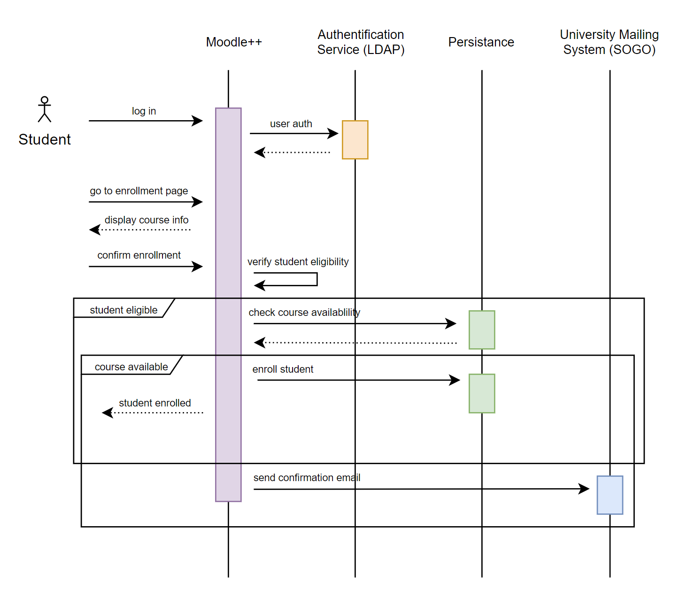

# 

# Introduction and Goals

Describes the relevant requirements and the driving forces that software
architects and development team must consider. These include

-   underlying business goals,

-   essential features,

-   essential functional requirements,

-   quality goals for the architecture and

-   relevant stakeholders and their expectations

## Requirements Overview

**Contents**

Short description of the functional requirements, driving forces,
extract (or abstract) of requirements. Link to (hopefully existing)
requirements documents (with version number and information where to
find it).

**Motivation**

///From the point of view of the end users a system is created or modified
to improve support of a business activity and/or improve the quality.///

From the point of view of the end users, mainly students and lecturers, as well as other ... , this system is to facilitate the 

**Form**

Short textual description, probably in tabular use-case format. If
requirements documents exist this overview should refer to these
documents.

Keep these excerpts as short as possible. Balance readability of this
document with potential redundancy w.r.t to requirements documents.

See [Introduction and Goals](https://docs.arc42.org/section-1/) in the
arc42 documentation.

## Quality Goals

**Contents**

The top three (max five) quality goals for the architecture whose
fulfillment is of highest importance to the major stakeholders. We
really mean quality goals for the architecture. Don’t confuse them with
project goals. They are not necessarily identical.

**Motivation**

You should know the quality goals of your most important stakeholders,
since they will influence fundamental architectural decisions. Make sure
to be very concrete about these qualities, avoid buzzwords. If you as an
architect do not know how the quality of your work will be judged…

**Form**

A table with quality goals and concrete scenarios, ordered by priorities

| Quality Goal | Quality Scenario |
|-------------|----------------|
| Learnability/Understandability | A new student can find the see the schedule, course contents, deadlines, and other resources without additional information and within the first minutes of using the application. |
| Accuracy | The correct grades, added by lecturers or by the system (in the case of automatic grading), are shown to the student. |
| Recoverability | A server crashes and a user session is recovered within an hour by using persistence mechanisms. |
| Fault tolerance | A user has bad internet connection. Upload process does not have to be started anew. |

## Stakeholders

**Contents**

Explicit overview of stakeholders of the system, i.e. all person, roles
or organizations that

-   should know the architecture

-   have to be convinced of the architecture

-   have to work with the architecture or with code

-   need the documentation of the architecture for their work

-   have to come up with decisions about the system or its development

**Motivation**

You should know all parties involved in development of the system or
affected by the system. Otherwise, you may get nasty surprises later in
the development process. These stakeholders determine the extent and the
level of detail of your work and its results.

**Form**

Table with role names, person names, and their expectations with respect
to the architecture and its documentation.

| Role/Name   | Contact        | Expectations       |
|-------------|----------------|--------------------|
| *\<Role-1>* | *\<Contact-1>* | *\<Expectation-1>* |
| *\<Role-2>* | *\<Contact-2>* | *\<Expectation-2>* |

# Architecture Constraints

**Contents**

Any requirement that constraints software architects in their freedom of
design and implementation decisions or decision about the development
process. These constraints sometimes go beyond individual systems and
are valid for whole organizations and companies.

**Motivation**

Architects should know exactly where they are free in their design
decisions and where they must adhere to constraints. Constraints must
always be dealt with; they may be negotiable, though.

**Form**

| Constraints | Background and/or Motivation |
| ------------------------- | ------------------------- |
| Run on every system | To make the application accessible to everyone, users must not require special/specific devices to use it.          |
| Integration with other university tools | The system should be compatible with existing tools and software of the university, such as the mailing (SOGO) and campus inforamtion system (CIS).  |
| Accessible from outside     | Users should not be required to be on premise to use the application. |
| Adaptable for different universities     | Design and features should be customizable and adjustable to the needs of individual universities. |

[//]: # (Simple tables of constraints with explanations. If needed you can
subdivide them into technical constraints, organizational and political
constraints and conventions e.g. programming or versioning guidelines,
documentation or naming conventions)

See [Architecture Constraints](https://docs.arc42.org/section-2/) in the
arc42 documentation.

# System Scope and Context

**Context View**

|Neighbor|Description|
|---|---|
|Student|Enrolls in a course through the system. Follows the schedule generated by the system. Finds course contents, information and other course resources, uploads assignments and takes online tests.|
|Lecturer|Uploads course contents, information and other course resources, from which the schedule will be automatially generated (by the system). Grades student assignments and tests, and gives feedback either individually or to groups.|
|Faculty Member|Tracks attandence for a class|
|Administrator|Manage student data, student enrollment. Can rework course schedule on demand.|
|University Mailing System (SOGO)|Automatic notification of schedule updates, grading. Central information system for students.|
|LDAP|Stores system data. Single Sign-on|

# Solution Strategy

**Introduction**

The project is implemented with service oriented architecture for the most part, but some services are handled in form of micro services.

Our strategies are mostly based on ease of use and accessibility, and as such essential functionality will be held as simple as possible.

Our strategies focus on providing an accessible university management tool for people who do not have extensive technical knowledge.

Another important factor is the consistency and security of the data.

| Quality Goal                                                 | Solution Approach         |
| ------------------------------------------------------------ | ------------------------- |
| Students should be able to access all functionality without additional training. | SOA                       |
| Resources and information should always be available; backups are required. | SOA                       |
| Only authorized users should be able to access services.     | Microservices (i.e. LDAP) |

# Building Block View

**Content**

The building block view shows the static decomposition of the system
into building blocks (modules, components, subsystems, classes,
interfaces, packages, libraries, frameworks, layers, partitions, tiers,
functions, macros, operations, data structures, …) as well as their
dependencies (relationships, associations, …)

This view is mandatory for every architecture documentation. In analogy
to a house this is the *floor plan*.

**Motivation**

Maintain an overview of your source code by making its structure
understandable through abstraction.

This allows you to communicate with your stakeholder on an abstract
level without disclosing implementation details.

**Form**

1. Level 1

| Block | Description |
|---|---|
| Courses | Main component handling courses |
| Grade Report System | Responsible for final reports |
| Persistance | Database and File handling |
| Student Enrollment and Managment | Handles information and status of students |
| Frontend web-service | webserver |

2. Level 2
2.1. Whitebox

TODO: img

| Block | Description |
|---|---|
| Course Material | Database access |
| Participants | Links enrolled students to courses |
| Assignments | Handles uploads and schedules for hand-ins |
| Exams | Handles times for exams and some automatic grading |
| Grading | Calculates grades from assignments and exams and forwards them to the mail system/grade report system |
| Attendance tracking | Collects attendance during classes to forward to enrollment system |
| Schedule Generator | Generates conflict free schedules |

2.1.1. Course Material (blackbox)
The course material component constructs a course in form of the defined course xml format (\*not actual), or constructs questions based on the material. It takes data from the persistence service. The following methods are available through its interface:
- `getFullCourse(lecturer)`: returns an xml formated course, the boolean `lecturer` toggles lecturer view (default: `false`)
- `getExamQuestions(class_start, class_end)`: returns exam questions (xml), start and end specify for which classes to take questions from
- `getAssignment(class)`: returns assignment text and deadline in unix epoch (xml) for each assignemnt in the class or an empty list, class specifies which class to take from

2.1.2. Assignments (blackbox)
The assignments component handles the upload window and file upload for assignemnts, which are stored with the persistence service.

lvl3

TODO: Make a class diagram

The building block view is a hierarchical collection of black boxes and
white boxes (see figure below) and their descriptions.

**Level 1** is the white box description of the overall system together
with black box descriptions of all contained building blocks.

**Level 2** zooms into some building blocks of level 1. Thus it contains
the white box description of selected building blocks of level 1,
together with black box descriptions of their internal building blocks.

**Level 3** zooms into selected building blocks of level 2, and so on.

See [Building Block View](https://docs.arc42.org/section-5/) in the
arc42 documentation.

## Whitebox Overall System

Here you describe the decomposition of the overall system using the
following white box template. It contains

-   an overview diagram

-   a motivation for the decomposition

-   black box descriptions of the contained building blocks. For these
    we offer you alternatives:

    -   use *one* table for a short and pragmatic overview of all
        contained building blocks and their interfaces

    -   use a list of black box descriptions of the building blocks
        according to the black box template (see below). Depending on
        your choice of tool this list could be sub-chapters (in text
        files), sub-pages (in a Wiki) or nested elements (in a modeling
        tool).

-   (optional:) important interfaces, that are not explained in the
    black box templates of a building block, but are very important for
    understanding the white box. Since there are so many ways to specify
    interfaces why do not provide a specific template for them. In the
    worst case you have to specify and describe syntax, semantics,
    protocols, error handling, restrictions, versions, qualities,
    necessary compatibilities and many things more. In the best case you
    will get away with examples or simple signatures.

***\<Overview Diagram>***

Motivation  
*\<text explanation>*

Contained Building Blocks  
*\<Description of contained building block (black boxes)>*

Important Interfaces  
*\<Description of important interfaces>*

Insert your explanations of black boxes from level 1:

If you use tabular form you will only describe your black boxes with
name and responsibility according to the following schema:

| **Name**         | **Responsibility** |
|------------------|--------------------|
| *\<black box 1>* |  *\<Text>*         |
| *\<black box 2>* |  *\<Text>*         |

If you use a list of black box descriptions then you fill in a separate
black box template for every important building block . Its headline is
the name of the black box.

### \<Name black box 1>

Here you describe \<black box 1> according the the following black box
template:

-   Purpose/Responsibility

-   Interface(s), when they are not extracted as separate paragraphs.
    This interfaces may include qualities and performance
    characteristics.

-   (Optional) Quality-/Performance characteristics of the black box,
    e.g.availability, run time behavior, ….

-   (Optional) directory/file location

-   (Optional) Fulfilled requirements (if you need traceability to
    requirements).

-   (Optional) Open issues/problems/risks

*\<Purpose/Responsibility>*

*\<Interface(s)>*

*\<(Optional) Quality/Performance Characteristics>*

*\<(Optional) Directory/File Location>*

*\<(Optional) Fulfilled Requirements>*

*\<(optional) Open Issues/Problems/Risks>*

### \<Name black box 2>

*\<black box template>*

### \<Name black box n>

*\<black box template>*

### \<Name interface 1>

…

### \<Name interface m>

## Level 2

Here you can specify the inner structure of (some) building blocks from
level 1 as white boxes.

You have to decide which building blocks of your system are important
enough to justify such a detailed description. Please prefer relevance
over completeness. Specify important, surprising, risky, complex or
volatile building blocks. Leave out normal, simple, boring or
standardized parts of your system

### White Box *\<building block 1>*

…describes the internal structure of *building block 1*.

*\<white box template>*

### White Box *\<building block 2>*

*\<white box template>*

…

### White Box *\<building block m>*

*\<white box template>*

## Level 3

Here you can specify the inner structure of (some) building blocks from
level 2 as white boxes.

When you need more detailed levels of your architecture please copy this
part of arc42 for additional levels.

### White Box \<\_building block x.1\_\>

Specifies the internal structure of *building block x.1*.

*\<white box template>*

### White Box \<\_building block x.2\_\>

*\<white box template>*

### White Box \<\_building block y.1\_\>

*\<white box template>*

# Runtime View

The runtime view describes concrete behavior and interactions of the
system’s building blocks in form of scenarios from the following areas:

-   important use cases or features: how do building blocks execute
    them?

-   interactions at critical external interfaces: how do building blocks
    cooperate with users and neighboring systems?

-   operation and administration: launch, start-up, stop

-   error and exception scenarios

Remark: The main criterion for the choice of possible scenarios
(sequences, workflows) is their **architectural relevance**. It is
**not** important to describe a large number of scenarios. You should
rather document a representative selection.

You should understand how (instances of) building blocks of your system
perform their job and communicate at runtime. You will mainly capture
scenarios in your documentation to communicate your architecture to
stakeholders that are less willing or able to read and understand the
static models (building block view, deployment view).

There are many notations for describing scenarios, e.g.

-   numbered list of steps (in natural language)

-   activity diagrams or flow charts

-   sequence diagrams

-   BPMN or EPCs (event process chains)

-   state machines

-   …

See [Runtime View](https://docs.arc42.org/section-6/) in the arc42
documentation.

## \<Student Enrollment>

TODO: description of the notable aspects of the interactions between the building block instances depicted in this diagram.

## \<Attendance Tracking>

**Steps:**
1. The faculty member logs in to the university management application.
2. The faculty member navigates to the attendance tracking page.
3. The faculty member selects the class session they want to track attendance for.
4. The system displays a list of enrolled students in the class.
5. The faculty member marks each student as present or absent.
6. The system updates the attendance data for the selected class session.
7. The system sends a notification to the students who were marked absent.

## \<Course Grades Management>

**Steps:**
1. The faculty member logs in to the university management application (Moodle++).
2. The faculty member navigates to the course grades page.
3. The faculty member selects the course they want to manage grades for.
4. The system displays a list of enrolled students in the course.
5. The faculty member enters the grades for each student in the course.
6. The system calculates and displays the course grade for each student.
7. The system updates the course grade data in the system.
8. The system sends a notification to the students regarding their updated course grade.

## \<View Course Material>

**Steps:**
1. The student navigates to the course dashboard.
2. The student selects the course they want to view the material for.
3. The student selects the "Course Material" tab.
4. The student browses the available material.
5. If desired, the student can download the material.

TODO: description of the notable aspects of the interactions between the building block instances depicted in this diagram.

## \<Generate Reports>

TODO: Diagram

**Steps:**
1. The administrator navigates to the "Reports" section.
2. The administrator selects the type of report they want to generate.
3. The administrator selects the parameters for the report, such as the date range or specific courses.
4. The system generates the report and displays it to the administrator.
5. If desired, the administrator can download the report.

# Deployment View

**Content**

The deployment view describes:

1.  technical infrastructure used to execute your system, with
    infrastructure elements like geographical locations, environments,
    computers, processors, channels and net topologies as well as other
    infrastructure elements and

2.  mapping of (software) building blocks to that infrastructure
    elements.

Often systems are executed in different environments, e.g. development
environment, test environment, production environment. In such cases you
should document all relevant environments.

Especially document a deployment view if your software is executed as
distributed system with more than one computer, processor, server or
container or when you design and construct your own hardware processors
and chips.

From a software perspective it is sufficient to capture only those
elements of an infrastructure that are needed to show a deployment of
your building blocks. Hardware architects can go beyond that and
describe an infrastructure to any level of detail they need to capture.

**Motivation**

Software does not run without hardware. This underlying infrastructure
can and will influence a system and/or some cross-cutting concepts.
Therefore, there is a need to know the infrastructure.

Maybe a highest level deployment diagram is already contained in section
3.2. as technical context with your own infrastructure as ONE black box.
In this section one can zoom into this black box using additional
deployment diagrams:

-   UML offers deployment diagrams to express that view. Use it,
    probably with nested diagrams, when your infrastructure is more
    complex.

-   When your (hardware) stakeholders prefer other kinds of diagrams
    rather than a deployment diagram, let them use any kind that is able
    to show nodes and channels of the infrastructure.

See [Deployment View](https://docs.arc42.org/section-7/) in the arc42
documentation.

## Infrastructure Level 1

Describe (usually in a combination of diagrams, tables, and text):

-   distribution of a system to multiple locations, environments,
    computers, processors, .., as well as physical connections between
    them

-   important justifications or motivations for this deployment
    structure

-   quality and/or performance features of this infrastructure

-   mapping of software artifacts to elements of this infrastructure

For multiple environments or alternative deployments please copy and
adapt this section of arc42 for all relevant environments.

***\<Overview Diagram>***

Motivation  
*\<explanation in text form>*

Quality and/or Performance Features  
*\<explanation in text form>*

Mapping of Building Blocks to Infrastructure  
*\<description of the mapping>*

## Infrastructure Level 2

Here you can include the internal structure of (some) infrastructure
elements from level 1.

Please copy the structure from level 1 for each selected element.

### *\<Infrastructure Element 1>*

*\<diagram + explanation>*

### *\<Infrastructure Element 2>*

*\<diagram + explanation>*

…

### *\<Infrastructure Element n>*

*\<diagram + explanation>*

# Cross-cutting Concepts

**Content**

This section describes overall, principal regulations and solution ideas
that are relevant in multiple parts (= cross-cutting) of your system.
Such concepts are often related to multiple building blocks. They can
include many different topics, such as

-   models, especially domain models

-   architecture or design patterns

-   rules for using specific technology

-   principal, often technical decisions of an overarching (=
    cross-cutting) nature

-   implementation rules

**Motivation**

Concepts form the basis for *conceptual integrity* (consistency,
homogeneity) of the architecture. Thus, they are an important
contribution to achieve inner qualities of your system.

Some of these concepts cannot be assigned to individual building blocks,
e.g. security or safety.

**Form**

The form can be varied:

-   concept papers with any kind of structure

-   cross-cutting model excerpts or scenarios using notations of the
    architecture views

-   sample implementations, especially for technical concepts

-   reference to typical usage of standard frameworks (e.g. using
    Hibernate for object/relational mapping)

**Structure**

A potential (but not mandatory) structure for this section could be:

-   Domain concepts

-   User Experience concepts (UX)

-   Safety and security concepts

-   Architecture and design patterns

-   "Under-the-hood"

-   development concepts

-   operational concepts

Note: it might be difficult to assign individual concepts to one
specific topic on this list.

See [Concepts](https://docs.arc42.org/section-8/) in the arc42
documentation.

## *\<Concept 1>*

*\<explanation>*

## *\<Concept 2>*

*\<explanation>*

…

## *\<Concept n>*

*\<explanation>*

# Architecture Decisions

**Contents**

The following architectural decisions were taken: 

| Context | Alternatives | Decision | Consequences |
|--------------------|-------------------|-------------------|-------------------|
| Inconsistent data with multiple servers | Central data storage | Data volume small enough -> singular DB sufficient | |
| Too many different features, confusing for non technical users | Keep simple, clearly highlight each features functionality | Choose essential functions and focus on those -> essential features easily visible, extra features/shortcuts for more advanced users | |
| The university this project is for already uses LDAP for authentication | | We will keep the UI simple and clearly highlight each feature's functionality | We will have to put more care into the design, which will take more time | We will have to put more care into the design, which will take more time |
| We plan to potentially expand our product to be used by different universities with different requirements in the future | | We will build our application in a service oriented style | The product is modular and customizable for other universities |
| The university this project is for already uses LDAP for authentication | | We will build upon that and also work with LDAP building our software | We won’t have to look into/use another way to authenticate users, which saves time |

**Motivation**

Stakeholders of your system should be able to comprehend and retrace
your decisions.

**Form**

Various options:

-   ADR ([Documenting Architecture
    Decisions](https://cognitect.com/blog/2011/11/15/documenting-architecture-decisions))
    for every important decision

-   List or table, ordered by importance and consequences or:

-   more detailed in form of separate sections per decision

See [Architecture Decisions](https://docs.arc42.org/section-9/) in the
arc42 documentation. There you will find links and examples about ADR.

# Quality Requirements

**Content**

This section contains all quality requirements as quality tree with
scenarios. The most important ones have already been described in
section 1.2. (quality goals)

Here you can also capture quality requirements with lesser priority,
which will not create high risks when they are not fully achieved.

**Motivation**

Since quality requirements will have a lot of influence on architectural
decisions you should know for every stakeholder what is really important
to them, concrete and measurable.

See [Quality Requirements](https://docs.arc42.org/section-10/) in the
arc42 documentation.

## Quality Tree

**Content**

The quality tree (as defined in ATAM – Architecture Tradeoff Analysis
Method) with quality/evaluation scenarios as leafs.

**Motivation**

The tree structure with priorities provides an overview for a sometimes
large number of quality requirements.

**Form**

The quality tree is a high-level overview of the quality goals and
requirements:

-   tree-like refinement of the term "quality". Use "quality" or
    "usefulness" as a root

-   a mind map with quality categories as main branches

In any case the tree should include links to the scenarios of the
following section.

## Quality Scenarios

**Contents**

Concretization of (sometimes vague or implicit) quality requirements
using (quality) scenarios.

These scenarios describe what should happen when a stimulus arrives at
the system.

For architects, two kinds of scenarios are important:

-   Usage scenarios (also called application scenarios or use case
    scenarios) describe the system’s runtime reaction to a certain
    stimulus. This also includes scenarios that describe the system’s
    efficiency or performance. Example: The system reacts to a user’s
    request within one second.

-   Change scenarios describe a modification of the system or of its
    immediate environment. Example: Additional functionality is
    implemented or requirements for a quality attribute change.

**Motivation**

Scenarios make quality requirements concrete and allow to more easily
measure or decide whether they are fulfilled.

Especially when you want to assess your architecture using methods like
ATAM you need to describe your quality goals (from section 1.2) more
precisely down to a level of scenarios that can be discussed and
evaluated.

**Form**

Tabular or free form text.

# Risks and Technical Debts

**Contents**

A list of identified technical risks or technical debts, ordered by priority

**Motivation**

“Risk management is project management for grown-ups” (Tim Lister,
Atlantic Systems Guild.)

This should be your motto for systematic detection and evaluation of
risks and technical debts in the architecture, which will be needed by
management stakeholders (e.g. project managers, product owners) as part
of the overall risk analysis and measurement planning.

**Form**

| Risk/Technical Debt | Definition |
|--------------------|-------------------|
| Grade management| Too many students might use the system during online   exams and on deadlines for assignments |
| Overload during exams | Small group responsible, might be bottlenecked -> ideally   supported by automation |
| Attandance tracking | Needs to happen during class -> preferably done by   students to relief lecturer |

See [Risks and Technical Debt](https://docs.arc42.org/section-11/) in
the arc42 documentation.

# Glossary

**Contents**

The most important domain and technical terms that your stakeholders use
when discussing the system.

You can also see the glossary as source for translations if you work in
multi-language teams.

**Motivation**

You should clearly define your terms, so that all stakeholders

-   have an identical understanding of these terms

-   do not use synonyms and homonyms

A table with columns \<Term> and \<Definition>.

Potentially more columns in case you need translations.

See [Glossary](https://docs.arc42.org/section-12/) in the arc42
documentation.

| Term        | Definition        |
|-------------|-------------------|
| *\<Term-1>* | *\<definition-1>* |
| *\<Term-2>* | *\<definition-2>* |
