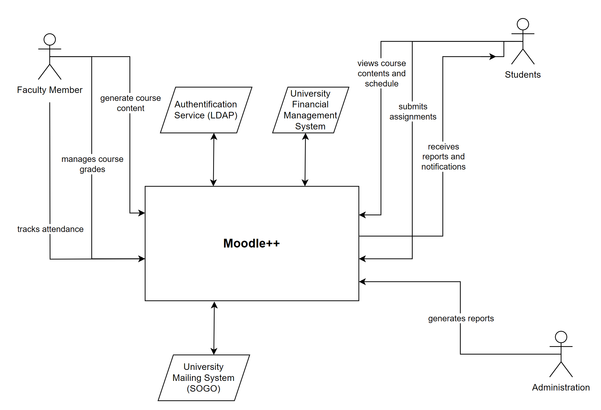

# Introduction and Goals

One of our business partners, the university of applied science FH Technikum Wien tasked us to build them a new university management platform. The goal is to create a uniform platform that simplifies all processes for student and class management, grading, and scheduling, and makes them available in one place. As such our stakeholders consist of different factions from the FH Technikum Wien, from here on out refered to as FHTW, which we will elaborate on later on in the document.

As the FHTW is a public institution, we need to set a focus on stability and testing, as we want to avoid inconsitent behaviour or servere technical issues that would impact day-to-day operations.

## Requirements Overview

Our client currently uses a mix of different systems to manage their day-to-day operations, and prefer a single platfrom incorporating all current functionality in one place. Furthermore some workflows are convoluted due to needing multiple different systems, and should be simplified in our system.

Our software has thus to implement the following main functions:

| Feature                 | Description                                                                                    | Actor          |
|-------------------------|------------------------------------------------------------------------------------------------|----------------|
| Student enrollment      | Choosing and managing courses                                                                  | Students       |
| Attendance tracking     | Automation of existing paper process                                                           | Lecturers      |
| Course resources        | Consistent access to material (slides, examples, exercises, and assignments), and online exams | Students       |
| Course grade management | Tracking of assignment and exam scores                                                         | Lecturers      |
| Report generation       | Calculates and sends out final reports based on the grades from the grade management system    | Administration |

## Quality Goals

| Quality Goal | Quality Scenario |
|--------------|------------------|
| Learnability & Understandability | A new student can find the see the schedule, course contents, deadlines, and other resources without additional information and within the first minutes of using the application. |
| Accuracy | The correct grades, added by lecturers or by the system (in the case of automatic grading), are shown to the student. |
| Recoverability | A server crashes and a user session is recovered within an hour by using persistence mechanisms. |
| Fault tolerance | A user has bad internet connection. Upload process does not have to be started anew. |

## Stakeholders

| Name/Role                              | Expectations                                                                                                    |
|----------------------------------------|-----------------------------------------------------------------------------------------------------------------|
| John Smith, Administrator              | An efficient and user-friendly platform for managing academic and administrative activities                     |
| Jane Doe, Senior Lecturer              | Easier and more efficient management of class information; more error correction through purpose-built software |
| Michael Lee, Chief Information Officer | Ability to take data-driven decision making through reporting and analytics                                     |
| Emily Chen, Student Representative     | Enhanced communication and collaboration possibilities among students, faculty, and staff                       |
| Sarah Johnson, Financial Officer       | A streamlined billing and payment processes                                                                     |

# Architecture Constraints

The following table contains the key constraints that should be adhered to, ordered by their relevance.  

| Constraints | Background and/or Motivation |
| ------------------------- | ------------------------- |
| Run on every system | To make the application accessible to everyone, users must not require special/specific devices to use it.          |
| Integration with other university tools | The system should be compatible with existing tools and software of the university, such as the mailing (SOGO) and campus inforamtion system (CIS).  |
| Accessible from outside     | Users should not be required to be on premise to use the application. |
| Adaptable for different universities     | Design and features should be customizable and adjustable to the needs of individual universities. |

[//]: # (Simple tables of constraints with explanations. If needed you can
subdivide them into technical constraints, organizational and political
constraints and conventions e.g. programming or versioning guidelines,
documentation or naming conventions)

# System Scope and Context

**Context View**

| Neighbor | Description |
|---|---|
| Student | Enrolls in a course through the system. Follows the schedule generated by the system. Finds course contents, information and other course resources, uploads assignments and takes online tests. |
| Lecturer | Uploads course contents, information and other course resources, from which the schedule will be automatially generated (by the system). Grades student assignments and tests, and gives feedback either individually or to groups. |
| Faculty Member | Tracks attandence for a class |
| Administrator | Manage student data, student enrollment. Can rework course schedule on demand. |
| University Mailing System (SOGO) | Automatic notification of schedule updates, grading. Central information system for students. |
| LDAP | Stores system data. Single Sign-on |

# Solution Strategy

- Usability for untrained users will be achieved by reducing the landing page to the most important functions, and putting more advanced functionality on corresponding subpages.
- The platform will be hosted on AWS to allow for easy automatic backups, and ensure availability.
- Due to using AWS we will be able to use Amazon provided analytics services to aid with data-driven decision making.
- We will keep using the univerities existing LDAP-service to ensure only authorized users can access certain functionality.

# Building Block View

1. Level 1

| Block | Description |
|---|---|
| Courses | Main component handling courses |
| Grade Report System | Separate application for final reports, partially adapted from legacy system |
| Persistance | Database and file handling service, uses MongoDB |
| Student Enrollment and Managment | Handles information and status of students, partially adapted from legacy system |
| Frontend web-service | NGinX web-server |

2. Level 2

| Block | Description |
|-----|-----|
| Course Material | Processes course data and interfaces with the web-service to display to the user |
| Participants | Links enrolled students to courses |
| Assignments | Handles uploads and schedules for hand-ins |
| Exams | Handles times for exams and some automatic grading |
| Grading | Calculates grades from assignments and exams and forwards them to the mail system/grade report system |
| Attendance tracking | Collects attendance during classes to forward to enrollment system |
| Schedule Generator | Generates conflict free schedules |

All services interface via REST, the full specifications will be found in the OpenAPI .yaml file.

## Course Material (Blackbox)
The course material component constructs a course in form of the defined course xml format (\*not actual), or constructs questions based on the material. It takes data from the persistence service. The following methods are available through its REST-interface, as defined in the OpenAPI .yaml file:
- `GET /course/{courseID}`: returns an xml formated course. A lecturers view will be returned automatically if authorized as such via token.
- `POST /course/{courseID}/exam`: returns exam questions (xml), `class_start` and `class_end` as paramters specify for which classes to take questions from
- `GET /course/{courseID}/assignemnts/{class}`: returns assignment text and deadline in unix epoch (xml) for each assignemnt in the class or an empty list, class specifies which class to take from (optional).

3. Level 3

# Runtime View

**Contents**

The runtime view describes concrete behavior and interactions of the
system’s building blocks in form of scenarios from the following areas:

-   important use cases or features: how do building blocks execute
    them?

-   interactions at critical external interfaces: how do building blocks
    cooperate with users and neighboring systems?

-   operation and administration: launch, start-up, stop

-   error and exception scenarios

Remark: The main criterion for the choice of possible scenarios
(sequences, workflows) is their **architectural relevance**. It is
**not** important to describe a large number of scenarios. You should
rather document a representative selection.

**Motivation**

You should understand how (instances of) building blocks of your system
perform their job and communicate at runtime. You will mainly capture
scenarios in your documentation to communicate your architecture to
stakeholders that are less willing or able to read and understand the
static models (building block view, deployment view).

**Form**

There are many notations for describing scenarios, e.g.

-   numbered list of steps (in natural language)

-   activity diagrams or flow charts

-   sequence diagrams

-   BPMN or EPCs (event process chains)

-   state machines

-   …

See [Runtime View](https://docs.arc42.org/section-6/) in the arc42
documentation.

## \<Runtime Scenario 1>

-   *\<insert runtime diagram or textual description of the scenario>*

-   *\<insert description of the notable aspects of the interactions
    between the building block instances depicted in this diagram.>*

## \<Runtime Scenario 2>

## …

## \<Runtime Scenario n>

# Deployment View

**Content**

The deployment view describes:

1.  technical infrastructure used to execute your system, with
    infrastructure elements like geographical locations, environments,
    computers, processors, channels and net topologies as well as other
    infrastructure elements and

2.  mapping of (software) building blocks to that infrastructure
    elements.

Often systems are executed in different environments, e.g. development
environment, test environment, production environment. In such cases you
should document all relevant environments.

Especially document a deployment view if your software is executed as
distributed system with more than one computer, processor, server or
container or when you design and construct your own hardware processors
and chips.

From a software perspective it is sufficient to capture only those
elements of an infrastructure that are needed to show a deployment of
your building blocks. Hardware architects can go beyond that and
describe an infrastructure to any level of detail they need to capture.

**Motivation**

Software does not run without hardware. This underlying infrastructure
can and will influence a system and/or some cross-cutting concepts.
Therefore, there is a need to know the infrastructure.

Maybe a highest level deployment diagram is already contained in section
3.2. as technical context with your own infrastructure as ONE black box.
In this section one can zoom into this black box using additional
deployment diagrams:

-   UML offers deployment diagrams to express that view. Use it,
    probably with nested diagrams, when your infrastructure is more
    complex.

-   When your (hardware) stakeholders prefer other kinds of diagrams
    rather than a deployment diagram, let them use any kind that is able
    to show nodes and channels of the infrastructure.

See [Deployment View](https://docs.arc42.org/section-7/) in the arc42
documentation.

## Infrastructure Level 1

Describe (usually in a combination of diagrams, tables, and text):

-   distribution of a system to multiple locations, environments,
    computers, processors, .., as well as physical connections between
    them

-   important justifications or motivations for this deployment
    structure

-   quality and/or performance features of this infrastructure

-   mapping of software artifacts to elements of this infrastructure

For multiple environments or alternative deployments please copy and
adapt this section of arc42 for all relevant environments.

***\<Overview Diagram>***

Motivation  
*\<explanation in text form>*

Quality and/or Performance Features  
*\<explanation in text form>*

Mapping of Building Blocks to Infrastructure  
*\<description of the mapping>*

## Infrastructure Level 2

Here you can include the internal structure of (some) infrastructure
elements from level 1.

Please copy the structure from level 1 for each selected element.

### *\<Infrastructure Element 1>*

*\<diagram + explanation>*

### *\<Infrastructure Element 2>*

*\<diagram + explanation>*

…

### *\<Infrastructure Element n>*

*\<diagram + explanation>*

# Cross-cutting Concepts

## Development concepts

The code should follow the Java style guidelines as defined [by Google](https://google.github.io/styleguide/javaguide.html), but should be adapted as needed.

The system shall have 90% test coverage, with security critical components having at least 95% test coverage.

Class properties are always private, and only have getters or setters if needed.

## Safety and security concepts

Any request needs to use the LDAP service for authentication. The LDAP service shall implement Role Based access control. LDAP was already used by the client beforehand, and to avoid security issues when switching to a new system, the existing system will be used.

## Architecture and design patterns

A service oriented architecture shall be used, services shall interface using REST. As AWS will be used, each service is a separate instance.

## Operation Concepts

All systems running in the AWS-cloud need to make daily backup, saving the last 3 days, then weekly back-ups for the last 4 weeks, then monthly backups. All backups will also be stored on an external system. Security critical system shall also make hourly backups, saving them for 24h. 

## User Experience concepts (UX)

Functionality per page shall always be limited to one topic to keep the UI simple, especially for new users. Each function shall also be clear in its use.

# Architecture Decisions

**Contents**

The following architectural decisions were taken: 

| Context | Alternatives | Decision | Consequences |
|--------------------|-------------------|-------------------|-------------------|
| Inconsistent data with multiple servers | Central data storage | Data volume small enough -> singular DB sufficient | |
| Too many different features, confusing for non technical users | Keep simple, clearly highlight each features functionality | Choose essential functions and focus on those -> essential features easily visible, extra features/shortcuts for more advanced users | |
| The university this project is for already uses LDAP for authentication | | We will keep the UI simple and clearly highlight each feature's functionality | We will have to put more care into the design, which will take more time | We will have to put more care into the design, which will take more time |
| We plan to potentially expand our product to be used by different universities with different requirements in the future | | We will build our application in a service oriented style | The product is modular and customizable for other universities |
| The university this project is for already uses LDAP for authentication | | We will build upon that and also work with LDAP building our software | We won’t have to look into/use another way to authenticate users, which saves time |

**Motivation**

Stakeholders of your system should be able to comprehend and retrace
your decisions.

**Form**

Various options:

-   ADR ([Documenting Architecture
    Decisions](https://cognitect.com/blog/2011/11/15/documenting-architecture-decisions))
    for every important decision

-   List or table, ordered by importance and consequences or:

-   more detailed in form of separate sections per decision

See [Architecture Decisions](https://docs.arc42.org/section-9/) in the
arc42 documentation. There you will find links and examples about ADR.

# Quality Requirements

## Quality Tree

## Quality Scenarios

| Id        | Scenario        |
|-------------|-------------------|
| 10.2.1 | Automatic grading is correct with a 3% margin of error |
| 10.2.2 | The correct grades, added by lecturers or by the system (in the case of automatic grading), are shown to the student.  |
| 10.2.3 | A user has bad internet connection. Upload process does not have to be started anew. |
| 10.2.4 | A server crashes and a user session is recovered within an hour by using persistence mechanisms. |
| 10.2.5 | A new student can find the see the schedule, course contents, deadlines, and other resources without additional information and within the first minutes of using the application. |

# Risks and Technical Debts

- Overload during peak usage:
Some systems, notably the exam system and assignment submission forms, have irregular usage patterns, and need to hold up during exams or before deadlines, while they also shall not use too many resources when not needed. AWS provides some level of flexibility, but only to a certain limit, and requires horizontally scalable software.

- Preexisting systems:
Due to concerns with switching to new systems, both the LDAP server and the report generation system are legacy services from the previous systems, and could lead to security issues in the future - especially LDAP, as it is used for authentication.

- Missing automation:
The grade management system is not automated, which could lead to bottlenecks with staff.

# Glossary

**Contents**

The most important domain and technical terms that your stakeholders use
when discussing the system.

You can also see the glossary as source for translations if you work in
multi-language teams.

**Motivation**

You should clearly define your terms, so that all stakeholders

-   have an identical understanding of these terms

-   do not use synonyms and homonyms

A table with columns \<Term> and \<Definition>.

Potentially more columns in case you need translations.

See [Glossary](https://docs.arc42.org/section-12/) in the arc42
documentation.

| Term        | Definition        |
|-------------|-------------------|
| *\<Term-1>* | *\<definition-1>* |
| *\<Term-2>* | *\<definition-2>* |
